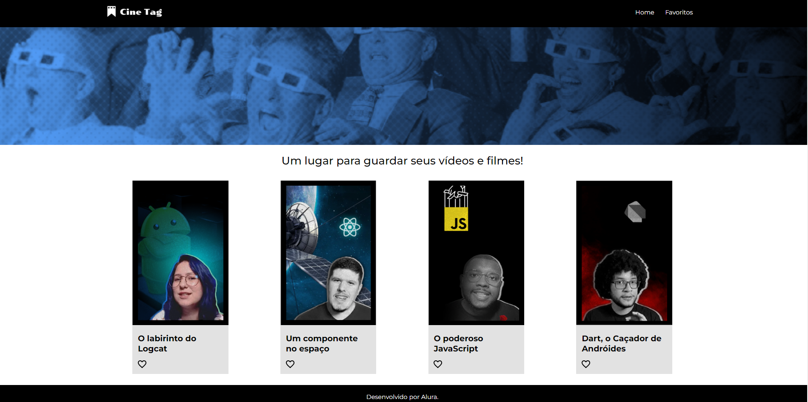

# Cinetag 🍿

Projeto "Cinetag" desenvolvido durante o curso "React: praticando React com Js" da Alura.

## Screenshots

## Ferramentas utilizadas

- HTML
- CSS
- JavaScript
- React
- React-router-dom
- My Json Server

## Funcionalidades
- Requisição GET de uma API Fake com "My Json Server";
- Utilização de Rotas Aninhadas, com componentes persistentes em todas as páginas;
- Uso de parâmetros de URL, com um player para cada filme. 

## Feito por:

Lucas Kenji (dinozindev).